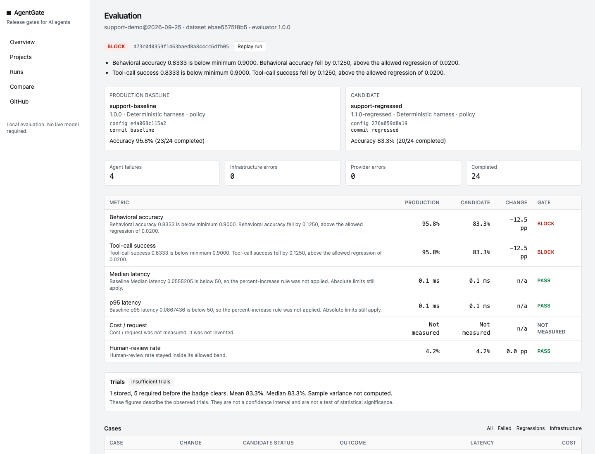
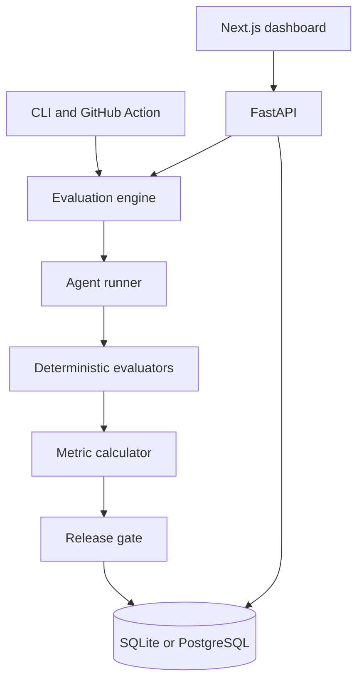

# AgentGate

CI/CD release gates for AI agents.

AgentGate answers one question: did this change make the agent better, and is it safe to ship?

A candidate is run on the same evaluation set as the production baseline. The release decision comes from deterministic checks, latency, cost, and tool use. An improvement on one metric does not hide a regression on another.

This project is an independent engineering project inspired by publicly available research and product concepts from InstaLILY. It is not affiliated with, endorsed by, or a reproduction of InstaLILY's internal systems.



The numbers in that screenshot were produced by running the engine on 25 September 2026. They are not hardcoded.

## Problem

An agent change can raise answer quality and still be a bad release. It can call the wrong tool, approve a return the policy forbids, get slower, or cost more. A single model run is also a noisy observation. Shipping on one score treats that noise as a result.

## Motivation

The useful comparison is candidate versus the current production behavior, on the same cases, with the reason for the decision visible. Deterministic checks carry the release. A subjective judge can ask for a person. It cannot pass or block on its own. Infrastructure failures are reported separately so a dead Docker daemon is not an agent score of zero.

## Architecture



The CLI, the API, and GitHub Actions call the same engine. Gate math is not reimplemented in the UI. The dashboard renders stored measurements and prints "Not measured" when a value is absent.

## Quick start

Python 3.9 or newer, and Node 20 or newer for the dashboard.

```bash
python3 -m venv .venv
source .venv/bin/activate
pip install -e "./backend[dev]"
agentgate validate
agentgate demo
agentgate serve
```

In another shell:

```bash
cd frontend
npm install
npm run dev
```

Open http://127.0.0.1:3000. `agentgate demo` stores three measured runs in `.agentgate/agentgate.db`.

PostgreSQL is optional:

```bash
docker compose up --build
```

That sets `AGENTGATE_DATABASE_URL` to Postgres. Without it, the API uses SQLite.

## Example evaluation

The demonstration agent is a customer-support harness with a fixed tool registry: `get_order`, `get_customer`, `check_return_policy`, `create_return`. The catalog and the 24 cases are synthetic. They are not a sample of real customers and they are not a benchmark.

The production harness treats a 30-day return window as exclusive, so a return on day 30 fails one case. The regressed harness still calls the policy tool, then approves delivered orders that are outside the window. The fixed harness treats day 30 as inside the window and refuses late returns. A fourth harness keeps the fix and sends policy and customer lookups to a person.

Recorded from `agentgate evaluate` on Python 3.9.6, 25 September 2026. Run ids and sub-millisecond latencies change between runs. The pass/fail counts do not, because this harness is deterministic.

Regressed candidate, decision **block**:

```text
Cases 20 passed, 4 failed, 0 infrastructure, 0 provider

Behavioral accuracy               95.8% -> 83.3%              -12.5 pp  BLOCK
Tool-call success                 95.8% -> 83.3%              -12.5 pp  BLOCK
Median latency                    0.1ms -> 0.1ms                   n/a  PASS
p95 latency                       0.1ms -> 0.1ms                   n/a  PASS
Cost / request             not measured -> not measured            n/a  N/A
Human-review rate                  4.2% -> 4.2%                +0.0 pp  PASS

Decision: BLOCK
```

Those four failures are `support-008`, `support-009`, `support-021`, and `support-022`: late returns the candidate approved. The baseline's only failure is `support-010`, the day-30 boundary. The fixed harness passes that case and the late-return cases: 24/24, decision **pass**. The cautious harness also passes 24/24, and its human-review rate moves from 4.2% (1/24) to 16.7% (4/24), so the decision is **review**.

Cost is "not measured" because the policy harness reports no tokens and the pricing file ships with an empty model table. The engine does not invent a price.

## Release-gate logic

Gates live in `evaluation/gates/default.yaml`. Each rule has a severity.

- **Pass.** Every applicable rule is inside its threshold.
- **Review.** A review-severity rule missed, a subjective judge flagged cases, or the run used `MockProvider`.
- **Block.** A critical rule missed. Accuracy and tool-call success are critical in the demo gate. A drop of more than 0.02, or a candidate accuracy below 0.90, blocks.

Missing measurements follow `on_missing`. The default for cost is `skip`, which prints "not measured" and does not become a zero. Latency percent-increase rules are not applied when the baseline is below 50 ms. The absolute latency maximum still applies. That keeps sub-millisecond harness noise out of the decision while still showing the measured times.

`MockProvider` is a scripted test double. A run that uses it cannot pass.

## Evaluation methodology

Full definitions are in [docs/methodology.md](docs/methodology.md).

Behavioral accuracy is the fraction of **agent-completed** cases that passed every applicable deterministic evaluator. Infrastructure and provider errors are excluded from the numerator and the denominator.

Deterministic evaluators:

- exact output match
- required tools, forbidden tools, tool order, and expected outcome
- a dataset-authored code test, executed in Docker

The optional LLM judge is subjective. A judge failure can move a pass to review. It cannot block, and it cannot be the only reason for a pass.

p95 latency is a linear interpolation between the closest ranks. It is descriptive. It is not a confidence interval.

## Replayability

Every run stores the dataset hash, harness hashes, provider, model, evaluator version, seed, trial count, and an environment fingerprint. `agentgate replay report.json` reruns that configuration. It refuses if the dataset, the harness, or the evaluator version has changed.

For the policy harness, replay reproduces the same case statuses, outcomes, and tool names. Wall-clock latency is measured again and is not required to match.

## Variance

`agentgate evaluate --trials 3` stores a mean, a median, and a sample variance of per-trial accuracy. The variance uses the n − 1 divisor. Fewer than `min_trials` (5 in the demo gate) is labeled **insufficient trials**. One trial can still gate a deterministic functional regression. It is not evidence that a stochastic model improved.

AgentGate does not compute a confidence interval and does not claim statistical significance.

## GitHub Actions

`.github/workflows/agentgate.yml` runs `./github-action` on pull requests. The action installs this repo's Python package, evaluates the baseline harness against the candidate harness, writes `agentgate-report.json`, posts the comment, and then exits non-zero on **block**.

The comment is the measured report plus a dashboard link when `AGENTGATE_DASHBOARD_URL` is set. If the URL is empty, the comment says the dashboard link is not configured. The GitHub page in the dashboard shows the token as configured or not, and it labels a locally rendered comment as a preview until a delivery is stored.

The checked-in candidate is the fixed harness, so a pull request that does not point the config at the regressed harness is expected to pass. To see a block, set `candidate` in `.agentgate/config.yaml` to `evaluation/agents/regressed.yaml`.

## Security

Details are in [docs/security.md](docs/security.md).

Model output, tool arguments, evaluation inputs, and GitHub content are untrusted. The agent can call only the four registered tools. Unknown tool names and malformed ids are refused. Model text is never executed.

Code tests come from the dataset, not from the model. They run in a container with no network, a read-only root, all capabilities dropped, `no-new-privileges`, a non-root user, memory and CPU limits, and a timeout. If Docker is missing, the case is an infrastructure error.

API keys are environment variables. A harness file that contains `api_key` is rejected. The HTTP API has no authentication. Keep it on localhost.

## Testing

```bash
pytest          # from backend/, or: python3 -m pytest backend/tests
cd frontend && npm test
```

The suite covers:

- a fixed agent passes
- the late-return harness is blocked, on the specific cases
- the fixed harness passes those cases again
- a latency regression blocks
- a cost regression blocks, using tokens and a price table
- a missing price stays "unavailable"
- forbidden and missing tool calls fail
- replay reproduces case status, outcome, and tool names
- invalid configuration fails with a path and a validation error
- an infrastructure exception is not an agent failure and is not an accuracy of 0
- a provider timeout is counted separately
- a Docker failure inside the code evaluator is an infrastructure error
- a failing code test is an agent failure
- an LLM judge failure requests review and leaves accuracy unchanged
- `MockProvider` cannot pass a gate

## Limitations

- The demonstration agent is a deterministic harness so the suite runs without an API key. It is not an LLM, and its sub-millisecond latency is not a model latency.
- OpenAI and Anthropic clients are implemented. They are not what produced the screenshot.
- The demo has one trial. The UI says the trial count is insufficient.
- Cost is not measured for the policy harness.
- There is no authentication, no migration tool, and no background worker. `create_all` builds the schema on startup.
- Code tests need a local Docker daemon and the `python:3.12-slim` image. The demo dataset does not include one.
- Relative latency changes under 50 ms are not gated. The absolute maximum still is.

## Future work

- A named statistical procedure, documented before any interval is shown.
- A queue for model-backed runs that exceed a request timeout.
- Migrations, authentication, and a GitHub App install flow.
- More than one agent family on the same engine. The case format is already not specific to support: input, expected outcome, tool constraints, an optional code test, and an optional rubric.

## Inspiration

InstaLILY has written publicly about evaluating agents on replayable tasks, preferring deterministic checks to a judge, and keeping infrastructure failures out of agent scores. Their public InstaBrain material discusses watching accuracy, latency, cost, and human review after a change.

AgentGate is a separate project built around those ideas: a gate in front of a change, a baseline to compare with, and measurements that come from a run. It is not their system.

This project is an independent engineering project inspired by publicly available research and product concepts from InstaLILY. It is not affiliated with, endorsed by, or a reproduction of InstaLILY's internal systems.
